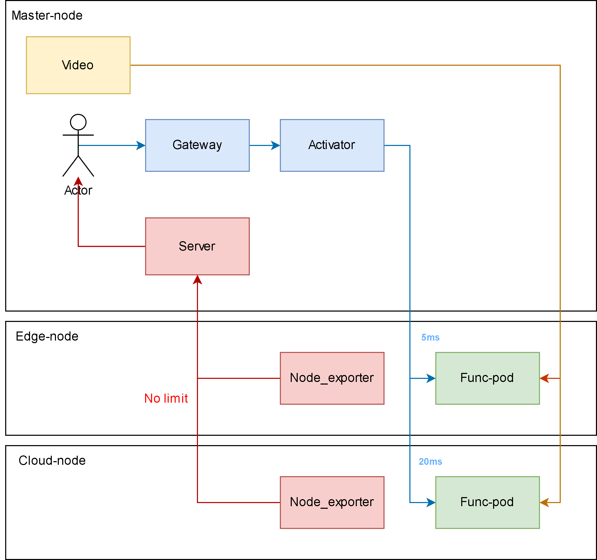

# measure_yolo
Simple yolo_app that can proccess video for analystic purpose

## Table of contents

- [Testbed design](#testbed-design)
- [How to use](#how-to-use)
    - [Running on local](#1-running-on-local)
    - [Running using Docker](#2-running-using-docker)
    - [Running using Kubnernetes](#3-running-using-kubernetes)
    - [Running using Knative](#4-running-using-knative)
- [How to contribute](#how-to-contribute)


## Testbed design

In this testbed, `video` is a docker image that broadcast its video. When `Actor` request for `yolo service`, `Func-pod` will request for video from `video` and using `yolo` to analysis it.

## How to use

In all usecases, you need to have a `video` at master-node

```bash
docker run -p 5000:5000 -p 2000:1935 docker.io/lazyken/broadcast-streaming:v1
```

### 1. Running on local

First, you need to install all dependencies
```bash
python3 -m venv .venv
source .venv/bin/activate
pip install -r requirements.txt
python3 main.py
```

Then you can use yolo to detect streaming now.
```bash
# curl yolo service to analyze one frame
curl localhost:8080/stream

# It should retun like this
{"confidences":[0.9373371005058289,0.8751891255378723,0.8259374499320984,0.8202735781669617,0.7035318613052368,0.5237972140312195,0.2642763555049896],"detections_summary":"image 1/1: 2160x3840 6 persons, 1 umbrella\nSpeed: 51.5ms pre-process, 2818.8ms inference, 86.6ms NMS per image at shape (1, 3, 384, 640)","inference_ms":2818.81,"nms_ms":86.64,"preprocess_ms":51.53,"success":true}


# curl yolo service to analyze video in <time_to_detect>
curl localhost:8080/stream/time/50
```

### 2. Running using Docker

First, you need to run container of the yolo service

```bash
docker run -d -p 8080:8080 -e RTMP_STREAM_URL="192.168.17.130:2000" docker.io/lazyken/measure-yolo:v1
```

Then you can use yolo to detect streaming now.
```bash
# curl yolo service to analyze one frame
curl localhost:8080/stream

# curl yolo service to analyze video in <time_to_detect>
curl localhost:8080/stream/time/50
```

### 3. Running using Kubernetes

First, you need to run container of the yolo service

```bash
kubectl apply -f deploy/kubernetes.yaml
```

Then you can use yolo to detect streaming now.
```bash
# curl yolo service to analyze one frame
curl measure-yolo.default/stream

# curl yolo service to analyze video in <time_to_detect>
curl measure-yolo.default/stream/time/50
```

### 4. Running using Knative

First, you need to run container of the yolo service

```bash
kubectl apply -f deploy/knative.yaml
```

Then you can use yolo to detect streaming now.
```bash
# curl yolo service to analyze one frame
curl measure-yolo.default/stream

# curl yolo service to analyze video in <time_to_detect>
curl

## How to contribute

After modify source code under [main.py](./main.py), you can build your own Docker image

```bash
docker build -t docker.io/lazyken/measure-yolo:v1 .

# Then you can push it to Dockerhub for future uses
docker push docker.io/lazyken/measure-yolo:v1
```


