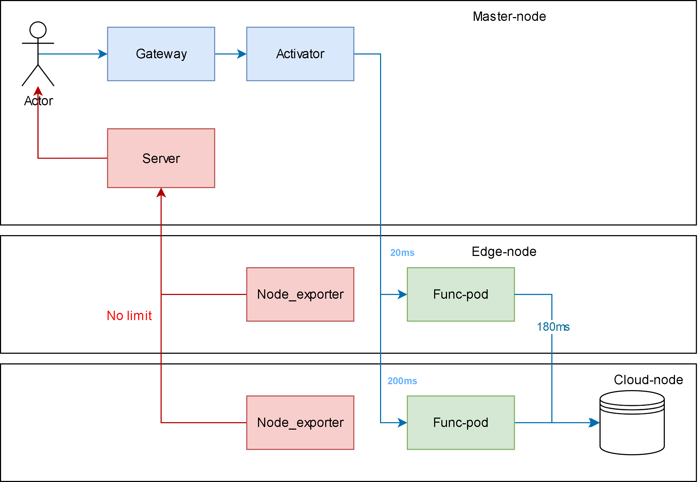

# measure_app
Simple app that query database for measuring on Kubernetes/Knative

## Testbed design


## Setup database at cloud-node

### Install MySQL Server
First, update your package index and install the `mysql-server` package.

1. Update your package list:

    ```bash
    sudo apt update
    sudo apt install mysql-server
    ```
2. Secure Your MySQL Installation

    After installation, run the included security script. This script will prompt you to set a `root password` remove `anonymous users`, disallow `remote root login`, and remove the `test database`. It's highly recommended to run this

    ```bash
    sudo mysql_secure_installation
    ```

    Use `y` for yes for most decision

3. Configure MySQL for Remote Access

    By default, MySQL only listens for connections from the local machine (`127.0.0.1` or `localhost`). You need to change this to allow connections from other IP addresses

    ```bash
    sudo nano /etc/mysql/mysql.conf.d/mysqld.cnf
    ```

    Find `bind-address`. Look for a line that looks like this:

    ```bash
    bind-address = 127.0.0.1
    ```

    Change the line into this 

    ```bash
    bind-address = 0.0.0.0
    ```

4. Create user for remote connection

    Log in to the MySQL shell as the root user
    ```bash
    sudo mysql
    ```

    Use the following SQL command. Replace `remote_user` with your desired username and `your_password` with a strong password. `%` mean allow connect from all host, replace it with a specific `IP address` if 
    ```sql
    CREATE USER 'username'@'%' IDENTIFIED BY 'your_password';
    GRANT ALL PRIVILEGES ON *.* TO 'remote_user'@'%' WITH GRANT OPTION;
    ```

## Running on local

```bash 
# Run query app
python3 main.py

# Test query prompt
# 1. Continuosly query database in a duration time (20s in this example)
curl localhost:5000/list-students?duration=20

# 2. Query 15th student
curl localhost:5000/processing_time/15
```

## Running using docker

```bash
# Build docker image
docker build -t docker.io/lazyken/measure-app:v1 .

# Run the image
docker run -d \ 
  -p 5000:5000 \  
  -e DB_HOST="<your database ip>" \
  -e DB_USER="<your username to db>" \   
  -e DB_PASSWORD="<your password to db>" \   
  docker.io/lazyken/measure-app:v1
```

Now you can test the image

```bash
# 1. Continuosly query database in a duration time (20s in this example)
curl localhost:5000/list-students?duration=20

# 2. Query 15th student
curl localhost:5000/processing_time/15
```

## Running on Kubernetes

```bash
kubectl apply -f deploy/kubernetes.yaml
```

Now you can test the image

```bash
# 1. Continuosly query database in a duration time (20s in this example)
curl hello.default/list-students?duration=5

# 2. Query 15th student
curl hello.default/processing_time/15
```

## Running on Knative

```bash
kubectl apply -f deploy/knative.yaml
```

Now you can test the image

```bash
# 1. Continuosly query database in a duration time (20s in this example)
curl http://hello.default.192.168.17.1.sslip.io/list-students?duration=5

# 2. Query 15th student
curl http://hello.default.192.168.17.1.sslip.io/processing_time/15
```


