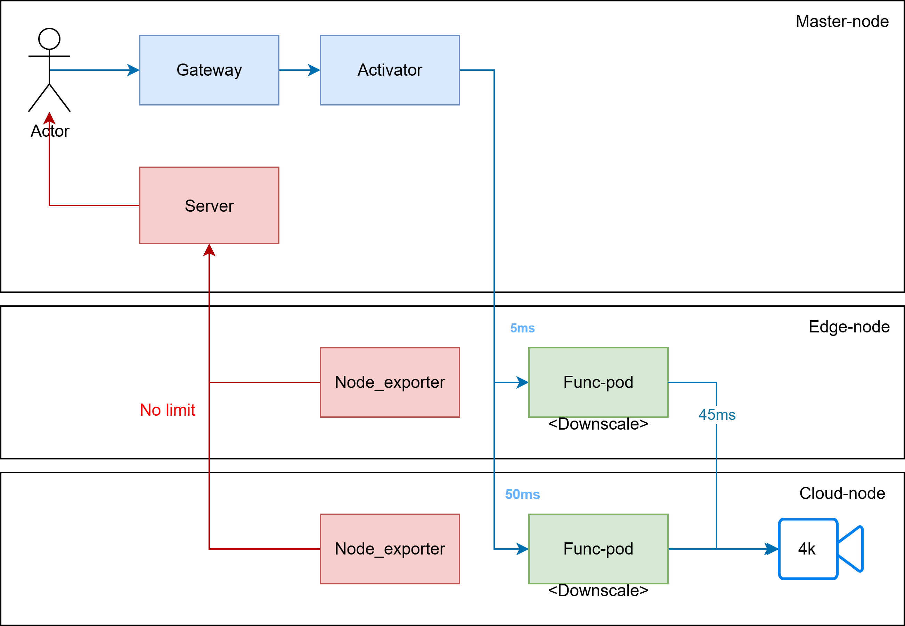

# measure_streaming
Simple app that can broadcast video for streaming and receive streaming video

## Table of contents

- [Table of contents](#table-of-contents)
- [Testbed design](#testbed-design)
- [How to use](#how-to-use)
    - [Running using terminal](#running-using-terminal)
        - [Broadcast video](#broadcast-video)
        - [Receive video](#receive-video)
    - [Running using Docker](#running-using-docker)
- [How to contribute](#how-to-contribute)


## Testbed design


## How to use
### Running using terminal

1. Convert origin video to 4K resolution

    ```bash
    ffmpeg -i input.mp4 -vf scale=3840x2160:flags=lanczos -c:v libx264 -preset slow -crf 19 output.mp4

    ```

    It may take a while until `ffmpeg` to convert video to 4K

2. Broadcast video at source

    ```bash
    # Replace *192.168.17.161* to your ip address
    ffmpeg \
    -re \
    -stream_loop -1 \
    -r 24 \
    -i output.mp4 \
    -f flv \
    -c:a aac \
    -preset ultrafast \
    -c:v libx264 \
    rtmp://0.0.0.0:1935/live/source
    ```

3. Receive the stream, downscale to 1080p, and forwarding it

    ```bash
    # Replace *192.168.17.161* to source ip address
    # And *192.168.17.162* to your forwarding device's ip address

    # 1. Using rtmp
    ffmpeg \
    -i "rtmp://192.168.17.161/live/source" \
    -vf "scale=1920:1080" \
    -c:v libx264 \
    -preset veryfast \
    -g 48 \
    -an \
    -f flv \
    "rtmp://0.0.0.0:1935/live/1080p"

    # 2. Using hls
    ffmpeg \
    -i "rtmp://192.168.17.161/live/source" \
    -vf "scale=1920:1080" \
    -c:v libx264 \
    -preset veryfast \
    -g 48 \
    -sc_threshold 0 \
    -f hls \
    -hls_time 4 \
    -hls_list_size 5 \
    -hls_flags delete_segments \
    -hls_segment_filename "/var/www/hls/segment%03d.ts" \
    "/var/www/hls/playlist.m3u8"
    ```

4. Receive video

    Replace *192.168.17.161* with your stream flow
    ```bash
    # 1. Using rtmp
    ffmpeg -i "rtmp://192.168.17.162/live/1080p" -f null -

    # 2. Using hls
    ffmpeg -i "http://192.168.17.162/live/playlist.m3u8" -f null -
    # Get time to first frame
    time ffmpeg -i "http://192.168.17.162/live/playlist.m3u8" -vframes 1 -f null -
    ```

### Running using Docker

1. Broadcast video at source

    ```bash
    docker run -d -p 5000:5000 -p 2000:1935 docker.io/lazyken/broadcast-streaming:v1

    # Start streaming at a preset resolution
    curl localhost:5000/stream/start?resolution=720p

    # Stop streaming
    curl localhost:5000/stream/stop

    # Get stream status
    curl localhost:5000/stream/status

    # Manually check if stream is running
    ffprobe "rtmp://localhost:2000/live/source"
    ```

    | Prefix | Resolution | Notes |
    | --- | --- | --- |
    | 240p | 426:240 | |
    | 360p | 640:360 | |
    | 480p | 854:480 | |
    | 720p | 1280:720 | HD |
    | 1080p | 1920:1080 | Full HD |
    | 1440p | 2560:1440 | 2K / QHD |
    | 2160p | 3840:2160 | 4K / UHD |

2. Receive and downscale

    ```bash
    # Running without API to control stream status
    docker run -d -p 8080:8080 -e SOURCE_IP="192.168.17.162:2000" -e SCALE_VALUE="1280x720" docker.io/lazyken/measure-streaming:v1

    # Running with API to control stream status
    docker run -d -p 5000:5000 -p 8080:8080 -e SOURCE_IP="192.168.17.162:2000" -e SCALE_VALUE="1280x720" docker.io/lazyken/measure-streaming:v2

    # Start receive video, downscale and forward (for v2 only)
    curl localhost:5000/stream/start

    # Stop streaming
    curl localhost:5000/stream/stop

    # Get stream status
    curl localhost:5000/stream/status
    ```

3. Receive video

    ```bash
    ffmpeg -i "http://localhost:8080/live/playlist.m3u8" -f null -

    # Get time to first frame
    time ffmpeg -i "http://192.168.17.162/live/playlist.m3u8" -vframes 1 -f null -
    ```

## How to contribute

1. For app that broadcast video at source

    Source code are located at [broadcast.py](/measure_streaming/broadcast.py) and Dockerfile to build code are located at [broadcast.Dockerfile](/measure_streaming/broadcast.Dockerfile).

    After change code, you can build the image.

    ```bash
    docker build -t docker.io/lazyken/broadcast-streaming:v1 -f broadcast.Dockerfile .
    ```

2. For app that receive and downscale

    ```bash
    docker build -t docker.io/lazyken/measure-streaming:v2 -f broadcast.Dockerfile .
    ```

