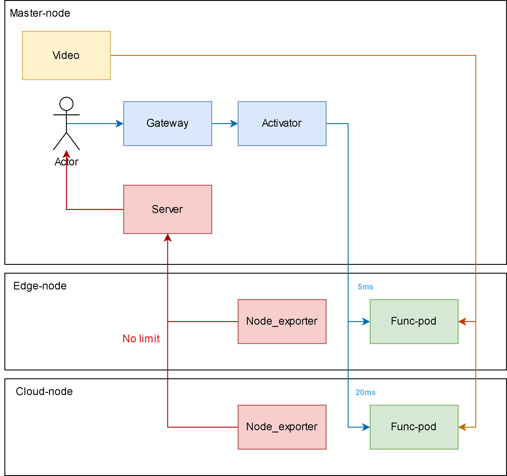

# measure_yolo
Simple yolo_app that can proccess video for analystic purpose

## Table of contents

- [Testbed design](#testbed-design)
- [How to use](#how-to-use)
    - [Running on local](#1-running-on-local)
    - [Running using Docker](#2-running-using-docker)
    - [Running using Kubnernetes](#3-running-using-kubernetes)
    - [Running using Knative](#4-running-using-knative)
- [How to contribute](#how-to-contribute)


## Testbed design

In this testbed, `video` is a docker image that broadcast its video. When `Actor` request for `yolo service`, `Func-pod` will request for video from `video` and using `yolo` to analysis it.

## How to use

### 1. Running on local

First, you need to install all dependencies
```bash
python3 -m venv .venv
source .venv/bin/activate
pip install -r requirements.txt
python3 main.py
```

Load/unload model

```bash
curl localhost:8080/model/load

curl localhost:8080/model/unload
```

Then you can use yolo to detect streaming now.
```bash
# curl yolo service to analyze one frame
curl -X POST -F "image=@analyze_image/4k.jpg" http://localhost:8080/detect

# curl the local-image endpoint used by TrafficGenerator.
# The first POST handled by a pod returns cold_start=true; later POSTs return cold_start=false.
curl -X POST \
  -H "Content-Type: application/json" \
  -H "X-Trafficgen-Request-Id: 1" \
  -d '{"request_id":1}' \
  http://localhost:8080/detect/local

# It returns a compact JSON response with request_id, cold_start,
# processing_time_ms, and model_inference_ms.
{"cold_start":true,"model_inference_ms":81.81,"request_id":1,"processing_time_ms":290.45,"success":true}

# curl yolo service to analyze video in <time_to_detect>
curl -X POST -F "image=@analyze_image/4k.jpg" http://localhost:8080/detect/time/5
```

### 2. Running using Docker

First, you need to run container of the yolo service

```bash
docker run -d -p 8080:8080 docker.io/lazyken/measure-yolo:v1
```

Load/unload model

```bash
curl localhost:8080/model/load

curl localhost:8080/model/unload
```

Then you can use yolo to detect streaming now.
```bash
# curl yolo service to analyze one frame
curl -X POST -F "image=@analyze_image/4k.jpg" http://localhost:8080/detect

# curl yolo service to analyze video in <time_to_detect>
curl -X POST -F "image=@analyze_image/4k.jpg" http://localhost:8080/detect/time/5
```

### 3. Running using Kubernetes

First, you need to run container of the yolo service

```bash
kubectl apply -f deploy/kubernetes.yaml
```

Load/unload model

```bash
curl measure-yolo.default/model/load

curl measure-yolo.default/model/unload
```

Then you can use yolo to detect streaming now.
```bash
# curl yolo service to analyze one frame
curl -X POST -F "image=@analyze_image/4k.jpg" http://measure-yolo.default/detect

# curl yolo service to analyze video in <time_to_detect>
curl -X POST -F "image=@analyze_image/4k.jpg" http://measure-yolo.default/detect/time/5
```

### 4. Running using Knative

First, you need to run container of the yolo service

```bash
kubectl apply -f deploy/knative.yaml
```

Then you can use yolo to detect streaming now.
```bash
# curl yolo service to analyze one frame
curl -X POST -F "image=@analyze_image/4k.jpg" http://measure-yolo.default/detect

# curl yolo service to analyze video in <time_to_detect>
curl -X POST -F "image=@analyze_image/4k.jpg" http://measure-yolo.default/detect/time/5

## How to contribute

After modify source code under [main.py](./main.py), you can build your own Docker image

```bash
docker build -t docker.io/lazyken/measure-yolo:v1 .

# Then you can push it to Dockerhub for future uses
docker push docker.io/lazyken/measure-yolo:v1
```


