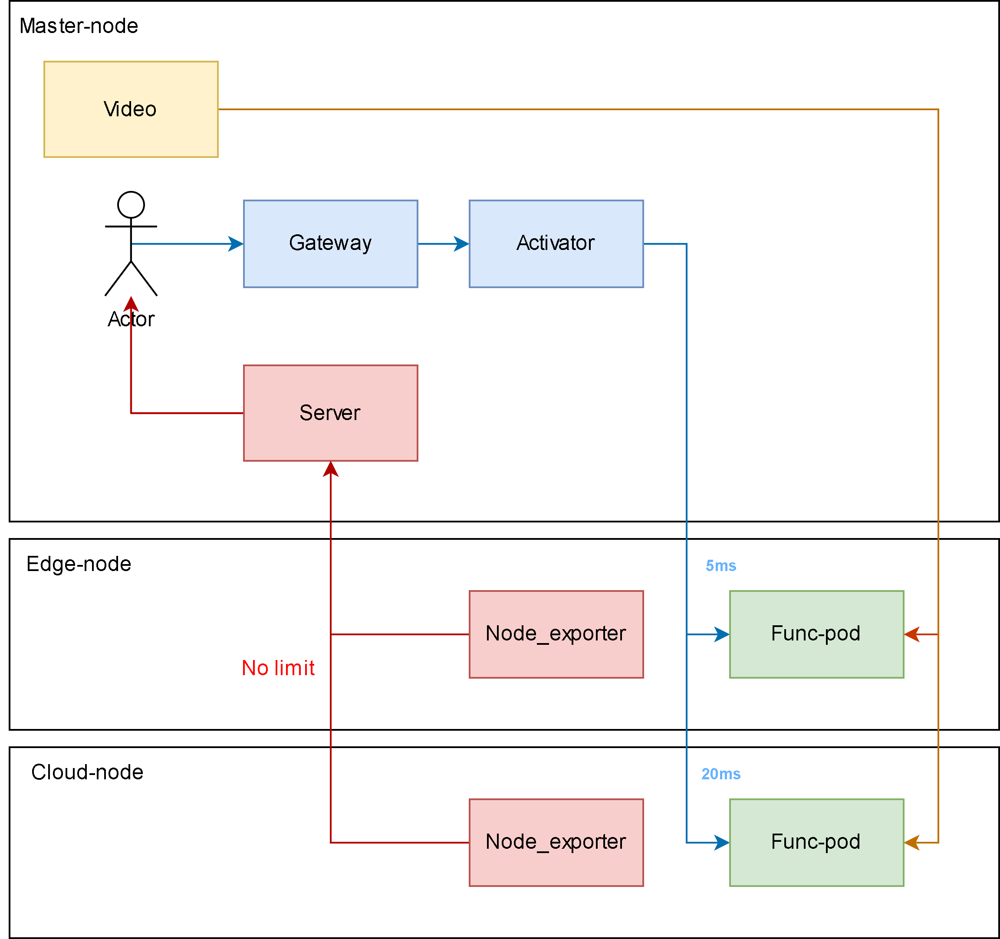

# measure_yolo
Simple yolo_app that can proccess video for analystic purpose

## Table of contents

- [Testbed design](#testbed-design)
- [How to use](#how-to-use)
    - [Running on local](#1-running-on-local)
    - [Running using Docker](#2-running-using-docker)
    - [Running using Kubnernetes](#3-running-using-kubernetes)
    - [Running using Knative](#4-running-using-knative)
- [How to contribute](#how-to-contribute)


## Testbed design

In this testbed, `video` is a docker image that broadcast its video. When `Actor` request for `yolo service`, `Func-pod` will request for video from `video` and using `yolo` to analysis it.

## How to use

In all usecases, you need to have a `video` at master-node

```bash
docker run -p 5000:5000 -p 2000:1935 docker.io/lazyken/broadcast-streaming:v1
```

### 1. Running on local

First, you need to install all dependencies
```bash
python3 -m venv .venv
source .venv/bin/activate
pip install -r requirements.txt
python3 main.py
```

Then you can use yolo to detect streaming now.
```bash
# curl yolo service to analyze one frame
curl localhost:8080/stream

# curl yolo service to analyze video in <time_to_detect>
curl localhost:8080/stream/time/50
```

### 2. Running using Docker

### 3. Running using Kubernetes

### 4. Running using Knative

## How to contribute


